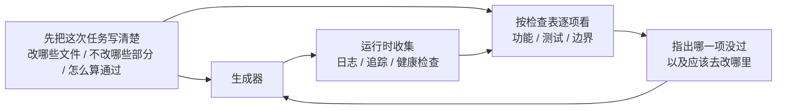

# CLAUDE.md -- 个人知识库

> 本项目是个人知识库应用。这个文件是规则和智能体地图；角色详情按地图读取对应文件。

## 规则地图

- `AGENTS.team.md`：团队级规则、RUP 过程、智能体路由、协作流程与工程约定。
- `agents.json`：schema v3 机器可读团队配置。
- `agents/<角色文件>`：当前职责的详细规则，按下方智能体地图定位。
- `feature_list.json`：功能状态追踪。
- `progress.md`：会话进度和当前已验证状态。
- `session-handoff.md`：跨会话交接记录。
- `quality-document.md`：质量快照、评级标准和待补证据。
- `evaluator-rubric.md`：迭代验收前的评分表和结论。
- `clean-state-checklist.md`：会话结束前和提交前要完成的干净状态检查。
- `docs/PROCESS.md`：RUP 阶段、迭代协议和退出标准。

## 智能体地图

- 规划者：`agents/01-规划者.md`
- 评估者：`agents/02-评估者.md`
- 数据与报表开发者：`agents/03-数据与报表开发者.md`
- 文件与同步开发者：`agents/04-文件与同步开发者.md`
- AI 与智能体开发者：`agents/05-AI-与智能体开发者.md`
- 多端体验开发者：`agents/06-多端体验开发者.md`
- 文档与交接负责人：`agents/07-文档与交接负责人.md`

## 双层可观测性

可观测性不是"多打点日志"那么简单。它分两层，缺一不可。

**运行时可观测性**：系统层的信号，包括日志、追踪、进程事件、健康检查，回答"系统做了什么"。

**过程可观测性**：harness 决策工件的可见性，包括计划、评分标准、验收条件，回答"为什么这个变更应该被接受"。

## 使用规则

- 每个智能体只读取 `智能体地图` 中分配给自己的角色文件，不一次性加载所有角色文件。
- 先读取 `AGENTS.team.md` 了解当前阶段、迭代、路由和协作流程，再读取当前职责对应的 `agents/<角色文件>`。
- 每次只开发一个功能，不要想一次性把所有问题都解决。
